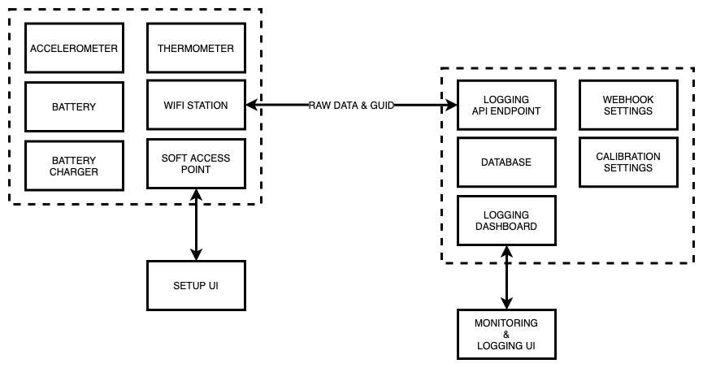
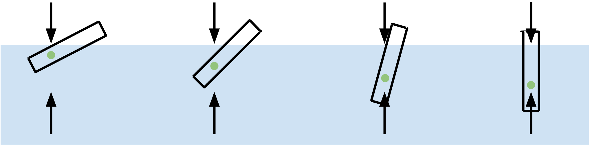
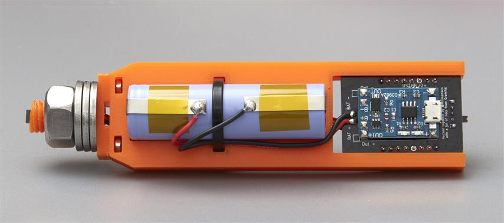
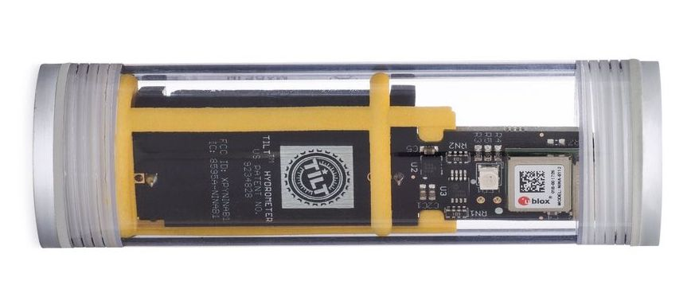

# Pilot
{: .no_toc }
## Table of contents
{: .no_toc .text-delta }

1. TOC
{:toc}

## Overview

Pilot is a digital hydrometer and thermometer that is placed inside a fermentation vessel during the fermentation of beer, wine, cider, mead, etc. It produces a continual log of gravity and temperature measurements without the need for human interaction or removal of a sample. By leveraging the principles of buoyancy, density, and gravity, measured and tracked with accelerometers, temperature sensors, and opensource software, it is not only possible to build such a device, but to make it accessible to tech-literate home brewers.

### How it Works

While traditional hydrometers sink vertically in order to measure the density of a liquid, Pilot both sinks and _tilts_ at a specific angle in proportion to the density of the fluid its submerged in. By using a digital accelerometer, the angle of tilt is measured to a high degree of accuracy, and therefore the change of gravity can be measured over time. Temperature is also logged to both monitor the temperature over time, as well as being factored into density calculations.

Encased and balanced in a water-tight housing, an ESP-01 module acts as the main microprocessor for Pilot. It's capabilities include reading sensor data from an I2C (inter-integrated circuit) bus, calling API (application program interface) endpoints via WIFI, hosting webpages as a soft access point, and consuming very little power by using a "deep sleep" mode. Along with the ESP-01, an I2C 3-axis accelerometer, I2C temperature senor, battery, and battery charger, make up the rest of the necessary hardware.

After construction, individual calibration is necessary for each device as they all have slightly different characteristics. This is done by using regression to find an equation that explains the correlation between measurements taken from a traditional hydrometer and the angle of Pilot in fluids of different densities. See [iSpindle Calibration Tool](http://www.ispindel.de/tools/calibration/calibration.htm). The calibration is stored on Pilot servers as "factory defaults" and is used to to adjust raw data received via the API. For ease of use, the data from Pilot is completely raw and therefore calibration adjustments can be made in the UI after its already in the hands of a home-brewer.

After calibration, in order for Pilot to log data, the ESP-01 must first be connected to the internet via WIFI. This is done via an HTML (hypertext markup language) firmware settings/setup dashboard hosted on the ESP-01 while in Soft Access Point mode. After connecting to the internet, the device can begin to send log data to the API. Along with the data, a GUID (globally unique identification) and other diagnostic data is sent. A user can log into Pilot servers by creating an account and registering the Pilot device's GUID, which attached to the hardware. This is the same GUID that will be sent along with all requests from the device.

After receiving data from the device, the Pilot API stores the data in a database, which is accessible via a the UI (user interface). This data is exportable in different formats and future versions will give the option of setting up a webhook to allow for users to build out their own infrastructure/monitoring tools.

## Background

### Hydrometers for Home Brewing

When brewing an alcoholic beverage, it is possible to measure the total amount of alcohol produced during fermentation. This is often noted as "ABV", or alcohol by volume, on a beer or wine label. When fermenting beverages at home, home brewers rely on a thermometer and _hydrometer_ to determine the final amount of alcohol in their brew. **It works by measuring how dense a liquid is expressed in** _**gravity**_**, or density relative to plain water. This can be then be used to determine much** _**sugar**_ **is in a liquid both before and after fermentation, and therefore, the amount of alcohol produced by the sugar-eating yeast.**

The other use of a hydrometer is to track the fermentation process over time. A brewer uses periodic measurements to determine if a brew has stalled out or if it’s ready to be bottled, for example. The timing of the fermentation can be used to help make decisions that effect the final beverage and offer insights that allows a brewer to replicate a successful batch.

### Using a Hydrometer

The process of taking a hydrometer measurement at home usually involves removing a portion of the fermenting liquid from the fermentation vessel, placing it in a graduated cylinder, and dropping in an analog device to take a measurement by eye. The brewer then must discard the sample so as to prevent contamination with the ongoing brew. This process introduces a seam for human error while realistically generating only up to a dozen or so measurements throughout a fermentation’s lifecycle.

Hydrometers measure the _relative density_ of a liquid based on the principle of buoyancy. The lower the density of the liquid, the further part B will sink. A scale is placed on part A to show depth that the instrument has sunk. The heavier a liquid, the higher the hydrometer will float.

Different hydrometers are calibrated for different liquids and ranges, and different scales are use for different industries. In brewing, a hydrometer is used to measure the amount of sugar in a brew both before and after fermentation. Before fermentation, the sugar content can be determined by a hydrometer to calculate the _potential_ alcohol level of the final brew. After fermentation, another measurement is taken to determine the net loss of sugar, which can be used to calculate the amount of alcohol present in the final beverage. (Any sugar lost during brewing has been consumed by yeast to produce a proportional amount of alcohol).

### Hydrometer Scales

#### Specific Gravity (SG)

The Specific Gravity scale is relative to the _weight_ of water. `1.000` is the SG of water at `4ºC`.

#### Potential Alcohol

The Potential Alcohol scale is used specifically for alcoholic beverage brewing. The typical scale ranges from 0 to 20 percent. Using this scale before fermentation will tell a brewer how much sugar could potentially be consumed to create a certain percentage of alcohol in the final beverage. In order to determine a final alcohol percentage, a second reading is taken _after_ fermentation. Subtracting the first reading by the second will give the brewer a final alcohol percentage.

#### Brix & Plato

The Brix Scale is based on the percentage of sugar in liquid by weight. Typical scales range from 0 to 30 and the number represents the percentage of sugar in the liquid _by weight_. For example, a reading of `15ºBx` in a `100g` sample means that there are `15g` of sugar in the liquid being measured. The Plato Scale is nearly interchangeable, but instead of being said to measure _sugar_, it’s said to measure _dissolved solids_, i.e. not everything factored into ºP is considered "fermentable."

#### Sugar

The Sugar Scale gives a reading of ounces of sugar per gallon. For example, a reading of `15` means that there are `15oz` per `1` gallon of liquid.

#### Calculation

There are conversion charts and calculators to convert to different scales for different needs. Typical glass hydrometers are calibrated with liquids at a specific temperature (old ones for brewing at `15C` and newer ones at `20C`), so it’s important to also take the temperature of the liquid you’re measuring. The weight of a liquid can be calculated based on different temperatures, so it isn’t necessary to try to adjust the temperature before taking a reading.

## Inspiration & Prior Art

### Commercial Products

On the market today is the [**Tilt Hydrometer**](https://tilthydrometer.com/) (formally Brewometer), a "free floating digital hydrometer and thermometer for continuous real-time monitoring." It pairs with an iOS or Android app or a Raspberry Pi running Tilt Pi via Bluetooth and it’s through this connection that it is able to connect to the internet to do things like post logs to Google Sheets. There isn’t a lot of information about how Tilt works or how it’s built, however, more information can be found in [U.S. Patent \#US20140260607A1](https://patents.google.com/patent/US20140260607A1/en).

The "free floating" bit of marketing copy might be to distinguish the Tilt from the [**Brew Perfect**](https://www.brewperfect.com/) (formally Beer Bug?), which I think might have been rebranded or is possibly no longer in business. With the Brew Perfect, a submersible "torpedo" is attached to the device and hung into the fermentation vessel. I believe the device uses the relative weight to measure the buoyancy of the torpedo to determine the density and gravity of the liquid. Combined with a temperature probe, the kit logs data to a proprietary app via WiFi.

### Opensource Solutions

In the opensource world exists the [**iSpindel**](https://github.com/universam1/iSpindel) (and other variants thereof). This is a [well-documented digital hydrometer and thermometer](https://github.com/universam1/iSpindel/blob/master/docs/README_en.md). The principle behind the iSpindle is theoretically similar to the Tilt: a change in buoyancy will cause the unit to _tilt_ (rather than to only rise and sink like a traditional hydrometer or the Brew Perfect) in proportion to the sugar content of the liquid. By using an accelerometer and a thermometer, the gravity of the liquid can be calculated.

Thanks to the community behind the device, it’s this solution where I find the most inspiration. It uses easily accessible opensource software and hardware and relies on a "perform" PET bottle for its housing.

There a [HomeBrew Talk](https://www.homebrewtalk.com/threads/ispindle-diy-electronic-hydrometer.598187/) thread following along with it’s development that should be helpful for troubleshooting, but the overall design theory is relatively straightforward. My first approach will be to build a slightly pared-down implementation of the iSpindel.

## Mechanical Properties & Design

### Buoyancy and Stability of Floating Bodies

As the density of must decreases during fermentation due to the consumption of sugar, we want a proportional amount of tilt to be experienced by the floating hydrometer. In order for this to happen, principles of _density_, _buoyancy_, _gravity_, and _stability_, all must work in concert.

As the must’s gravity lowers, the hydrometer sinks lower into the liquid and the angle of the device approaches vertical. This is because volume of liquid that must be displaced _increases_ as the density of that liquid _decreases_ in order for the hydrometer to stay afloat. The center of mass being towards the bottom of the device means that the center of buoyancy is also located towards the bottom, and this concentration of forces towards one end causes the device to tilt.

This _tilting_ is due to tiny incremental shifts that cause the center of buoyancy to reorient with respect to the center of mass. As this happens, the forces of gravity and buoyancy find equilibrium only after the device’s tilt angle shifts. Given that these two sole forces on device continually form a neutral equilibrium, and that the mass, center of mass, and density of the device are constant, we can deduce that the density of the liquid is the only factor that will cause the device’s angle to change. Combined with the temperature, we can then calculate the gravity.

### Calibration & Balance

In order for the hydrometer’s tilt to be sensitive to changes in density of the fluid, and in order for us to calculate gravity from the tilt angle, we must calibrate the hydrometer’s physical design. To do this, we should place the hydrometer in pure water at `20ºC` with `1.000 SG`, and use ballasts (small weights like nuts or inert pellets), to ensure the center of mass is concentrated towards the bottom, but also that the device will list at an angle (`20º +/- 5º` [as recommended by the iSpindle documentation](https://github.com/universam1/iSpindel/blob/master/docs/FAQ-en.md)). This is likely so that at (or near) the lowest gravity readings, the hydrometer will still float and tilt at a measurable angle. Once the device is physically balanced, we can then begin to calibrate the devices firmware to correlate the angle of heel to the gravity of the fluid. This is covered later.

### Physical Construction

The physical construction of the digital hydrometer must meet the following criteria:

* The electronic components must fit within the housing
* There is a water-tight housing around the electrical components
* It is able to withstand the wet, acidic, and alcoholic environment of home brewing
* It must be food safe and not release contaminants
* The battery and other electronic components must be accessible for recharging/servicing
* The the device should fit within the opening of different fermentation vessels
* The construction shall not interfere with wireless signals required for operation
* It should be able to be sanitized with home brewing sanitation chemicals
* It should continue to operate after reasonable drops, falls, and bumps

#### Preform PET Bottle ("Petling")

For all of these criteria, a readily available solution has been found and tested by the iSpindle community: a "petling" or preform PET bottle. A preform is an intermediate product that is subsequently blown into a polyethylene terephthalate (PET) container. Once heated in a mold the containers are blown into a variety of markets to create a variety of container shapes, sizes, thicknesses, colors, etc. They’re commonly used in the geocaching community as durable containers to hide small caches in, and therefore are available in geocaching marketplaces relatively cheaply. Common ones in geocache shops, ([Geocache One for example](https://www.geocacheone.com/en/p/pet-preform-cache-container-clear)) are around `13cm` in length and have an outer diameter of `2.5cm` and cost `~$2.00 USD`. Most of them weight between `10g` and `50g` at their heaviest/largest.

[Polyethylene terephthalate](https://omnexus.specialchem.com/selection-guide/polyethylene-terephthalate-pet-plastic) is the most commonly recycled plastic. It can be approved as safe for contact with foods and beverages by the FDA, Health Canada, EFSA & other health agencies, has an excellent resistance to alcohols and diluted acids, and is known for its good gas (oxygen, carbon dioxide) and moisture barrier properties. Given that PET fermentation vessels are often used in home brewing, it is safe to say that petlings can be sanitized and will not release contaminants.

The caps of petlings are usually [high density polyethylene (HDPE)](https://omnexus.specialchem.com/selection-guide/polyethylene-plastic#HDPE), another plastic that can be approved as food safe. Although it has properties that should ensure its resistance to breaking down in a brewing environment, if ballasted correctly, the cap of the petling should have limited contact with the must.

#### PET Centrifuge Tube

Similar to the petling, a plastic centrifuge tubes (often used for medical lab testing) are also readily available and are inexpensive, water-tight, come in a variety of sizes.

#### Glass Test Tubes and Vials

An alternative to PET preforms could be glass vials and test tubes that include a [high density polypropylene](https://omnexus.specialchem.com/selection-guide/polyethylene-plastic#HDPE) cap with a foam or rubber gasket. These have all of the advantages of the PET bottles, with added scratch resistance and avoidance of plastic pollution. Disadvantages include being more fragile, more expensive, and heavier.

Without testing, it’s difficult to know for sure if a glass alternative to petlings would be suitable, although I have a general aversion to plastics.

### Housing for Electronics

⚠️ _**TODO**: Once a bill of materials has been finalized I can design an appropriate housing._

#### iSpindle

The iSpindle community has developed several versions of a 3D-printable "[drawer](https://github.com/universam1/iSpindel/tree/master/drawer)," to hold and balance the various electronics and ballasts. I wish to take a similar approach.

#### Tilt

The Tilt seems to employ a plastic mechanism for housing the electronics, offset from center, in order to cause the device to tilt while floating.